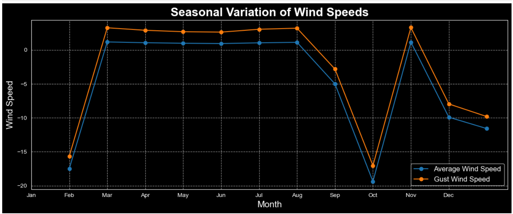
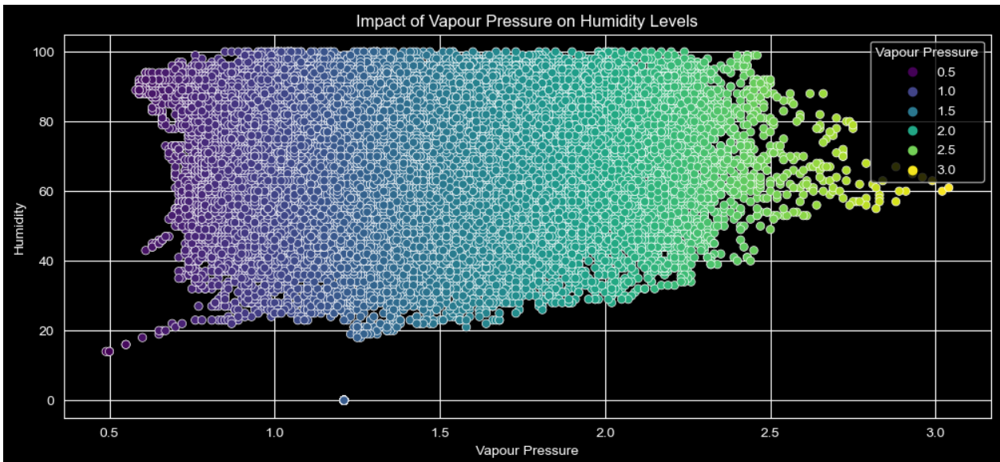
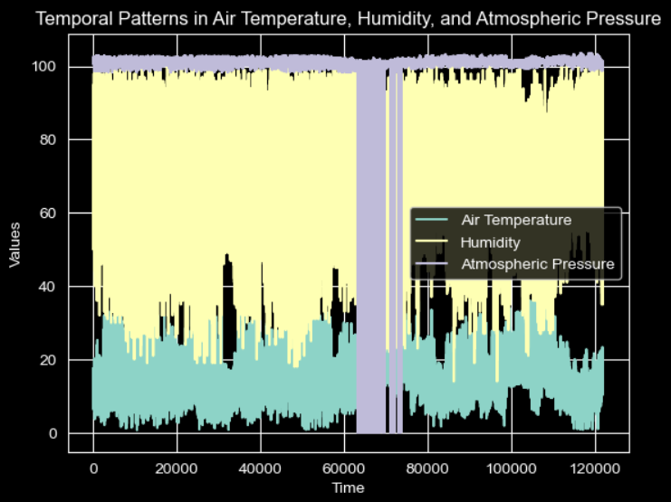
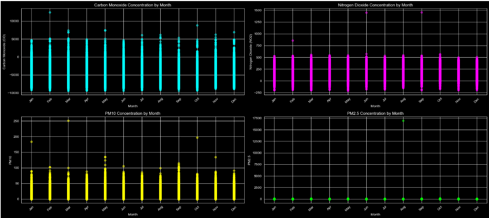
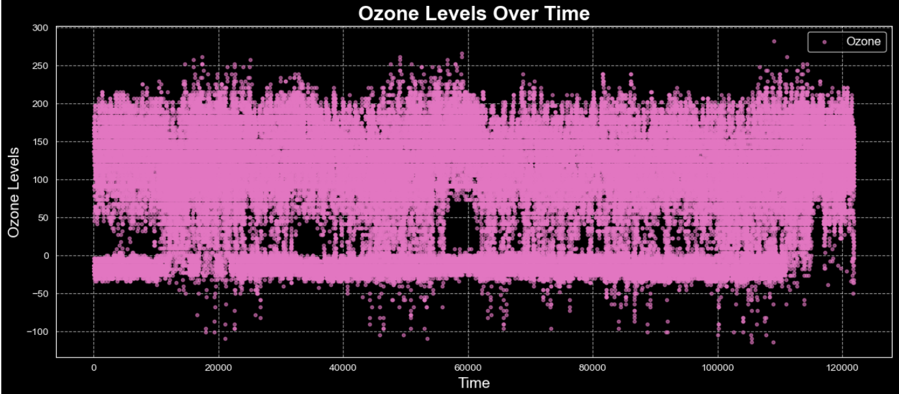
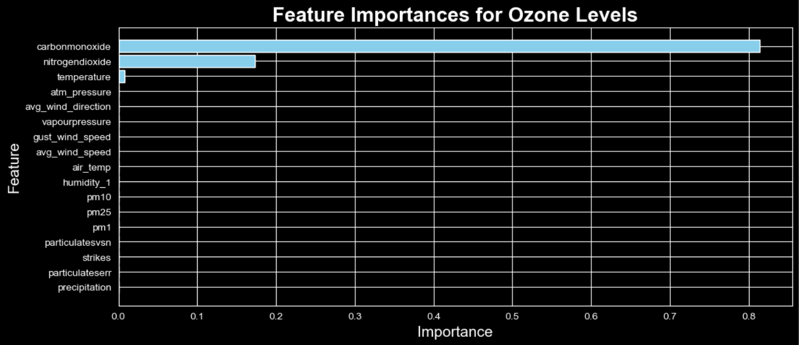
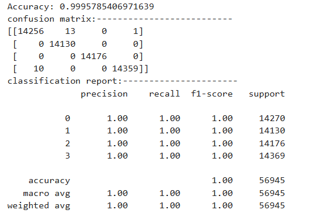

# Weather classification system

### Scenario
As an urban planner or agricultural manager, I need to accurately classify different weather conditions using environmental features to determine the optimal times for infrastructure projects and agricultural activities. This will ensure that operations are conducted under favorable weather conditions, thereby providing actionable insights for planning and decision-making.

### What this use case will teach us
At the end of this use case you will:

Understand how to preprocess and analyze environmental data.
Learn how to build and evaluate a machine learning model for classification tasks.
Gain experience in feature selection and engineering for weather-related datasets.
Develop skills in using Python libraries such as Pandas, Scikit-learn, and Matplotlib.
Understand the importance of accurate weather classification for planning and decision-making in various sectors.
introduction
In this use case, we aim to develop a robust machine learning model capable of accurately classifying various weather conditions such as sunny, cloudy, rainy, and stormy using environmental features. These features include ambient air temperature, relative humidity, atmospheric pressure, wind speed and direction, and gust wind speed. Accurate weather classification is important for optimizing the timing of infrastructure projects and agricultural activities, ensuring that operations are conducted under favorable weather conditions. By leveraging machine learning techniques, we can provide actionable insights for planning and decision-making.

### Background
Weather conditions have a significant impact on various sectors, including agriculture, construction, and transportation. Accurate weather forecasts and classifications can help in planning and executing operations more efficiently. For instance, farmers can optimize planting and harvesting times based on expected weather conditions, while construction projects can be scheduled to avoid adverse weather that could delay progress or compromise safety.

### In this project, we will use historical weather data from Melbourne's open data portal. The datasets include:

Microclimate sensors data — CoM Open Data Portal (melbourne.vic.gov.au)

Argyle Square Weather Stations (Historical Data) — CoM Open Data Portal (melbourne.vic.gov.au)

Argyle Square Air Quality — CoM Open Data Portal (melbourne.vic.gov.au)

## Dataset Information

#### The dataset for this project includes the following features::

- Ambient air temperature (°C)
- Relative humidity (%)
- Atmospheric pressure (hPa)
- Wind speed (m/s)
- Wind direction (degrees)
- Gust wind speed (m/s)
>
 These features will be used to classify weather conditions into categories such as sunny, cloudy, rainy, and stormy. The dataset will be preprocessed to handle any missing values, outliers, or inconsistencies - before being used to train the machine learning model.

### skill set
 - Datacleaning
 - Data analysis and visualizations
 - Machine Learning(supervised Learning)
   - Logistic Regression
   - Support Vector Machine(SVM)
   - Decision Tree
   - AdaBoost classifier
   - Random Forest Classifier
- Basic Meteorology
- Pickle

### steps taken 

#### Data cleaning/preparation
Data loading and with API
Handling missing Values
Data cleaning and formatting

#### Feature engineering
- removing the outlier
- finding the correlation
- getting the truth label for the dataset
- normalizing/standardizing the dataset
- merging dataset together
- feature selection
- feature encoding

#### Exploratory Data Analysis(EDA)
- Variation od Avg_Wind_speed and Gust_Wind_speed
- Impact of Vapour Pressure on Humidity
- Patterns in Air Temperature, Humidity, and Pressure
- patterns of pollutants across the year
- Efect of pollutants across different years
- determine the features that contributed to high rate of Ozone

#### Machine learning and modelling
- dimensionality reduction(t-SNE)
- resampling technique(smote)
- Model training
- prediction

#### deployment
- pickle

  
  

## Variation od Avg_Wind_speed and Gust_Wind_speed¶
we are typically trying to understand the relationship between typical wind conditions and extreme wind events

This analysis shows the seasonal variation of average wind speed and gust wind speed throughout the year.The graph shows that in February and September, both average and gust wind speeds peak, indicating stronger winds during these months. Conversely, December and October experience significant drops in wind speeds, with December starting low and October having a notable decline after the September peak. This behavior during these periods may be due to changes seen in the winter and autumn months.

  

## Impact of Vapour Pressure on Humidity

I seek to understand how changes in the amount of water vapor in the air (measured as vapor pressure) influence the level of moisture or humidity in the atmosphere.

The visualisation shows how vapour pressure and humidity levels are related, using different colors to represent various vapour pressure values. Higher vapour pressure, shown in green and yellow, usually goes along with higher humidity levels. Most data points fall between 1.0 and 2.5 vapour pressure units, with humidity levels ranging from 0% to 100%.
>
When humidity levels are high (above 60%), vapour pressure values are spread out but tend to be higher. On the other hand, when humidity is low (below 40%), vapour pressure is generally lower, shown in purple and blue. This pattern suggests that higher humidity often means higher vapour pressure and more concentrated vapour pressure, though there is some variation.

  

## Patterns in Air Temperature, Humidity, and Pressure

I aim to identify and analyze how these three atmospheric variables interact over time under different conditions. The goal is to explore potential relationships, seasonal trends, or fluctuations in temperature, humidity, and pressure, providing insights into weather patterns, climate behavior, and environmental conditions.

This analysis shows how air temperature, humidity, and atmospheric pressure change over time. The high and consistent levels of humidity suggest that the environment remains moist throughout the recorded period. Humidity levels stay quite high most of the time, which indicates a steady moisture presence, possibly due to frequent rainfall or high moisture in the air. This moisture could have a significant impact on local weather conditions and daily life.

The air temperature fluctuates noticeably, showing frequent rises and falls. This pattern suggests regular cycles in temperature, likely driven by daily weather changes or seasonal effects. These temperature changes are typical of environments where temperatures shift between day and night or during different seasons.
>
Meanwhile, the atmospheric pressure remains relatively stable, with only slight variations. This steady pressure suggests that large weather changes, such as storms or fronts, may not be common during the observed period. The combination of stable pressure and fluctuating temperature could point to a climate where conditions like rain or cloudy days are frequent, but severe weather events are rare.

  

## patterns of pollutants across the year

I aim to examine how levels of various pollutants change throughout the year, identifying any seasonal trends, peak periods, or fluctuations. The goal is to understand when pollutant levels are highest or lowest, which can help in forecasting air quality, understanding environmental impacts, and informing public health strategies.

### Carbon Monoxide (CO) and Nitrogen Dioxide (NO2):

These pollutants have levels that go up and down every month, but there are no clear trends showing they are increasing or decreasing over time. This suggests that the sources of these pollutants, like cars and factories, are consistent throughout the year.

### PM10 and PM2.5: 
In terms pf PM10(particulate matter) levels also fluctuate each month without a clear trend, which might be due to weather changes or different activities. PM2.5(particulate matter) levels are stable and low throughout the year, indicating that efforts to control this pollutant might be effective.

  

## Ozone levels across different years

Aim to examine how ozone concentrations have varied over multiple years, identifying any long-term trends. The goal is to understand changes in ozone levels over time, which can provide insights into the effectiveness of environmental regulations, the impact of climate change, and implications for air quality and public health.

The graph shows that ozone levels have remained fairly consistent from 2021 to 2024, with most values concentrated between 100 and 200 units. This indicates that the ozone levels in the area have stayed stable throughout this period. There is a small amount of variation outside of this range, but the majority of the data suggests that pollution sources related to ozone have not significantly increased or decreased over time. There are a few outliers, especially with negative values, that may need further investigation or data cleaning.
>
If this trend continues, there could be long-term implications for air quality and public health. Consistently high ozone levels could negatively affect the environment and human health if left unchecked. It’s important to monitor these levels closely and take action to reduce pollution sources where possible. Maintaining stable ozone levels is positive, but efforts should still focus on reducing pollutants to improve air quality and prevent any potential harm to health and the environment.

  

## features that contributed to high rate of Ozone level across the years

seeks to identify and analyze the key factors that influence elevated ozone concentrations

The analysisshows that carbon monoxide and nitrogen dioxide are the biggest factors affecting ozone levels. Carbon monoxide has the highest impact, meaning it has a strong connection to ozone, likely because of its role in chemical reactions in the air. Nitrogen dioxide also significantly affects ozone, especially in places with heavy traffic emissions. Other factors like temperature have a smaller effect. This suggests that controlling carbon monoxide and nitrogen dioxide emissions is key to managing ozone levels effectively.

  

## Model training and Prediction
### Using a logistic regression
>
>>Cross-validated accuracy scores: [0.75188779 0.75094389 0.74846343 0.75250241 0.75155307]
>>>Average accuracy: 0.75
>>>>training_accuracy : 0.751083286870168
>>>>>testing_accuracy : 0.7494073228553868

The logistic regression model performs fairly well, with an average accuracy of 75% across cross-validation, training, and testing. The close alignment between training accuracy (75.1%) and testing accuracy (74.9%) suggests that the model generalizes reasonably well to new data, with no major overfitting.

### Using support Vector Machine
>
>>Cross-validated accuracy scores: [0.94387128 0.9433225  0.93954693 0.94512249 0.94261881]
>>>Average accuracy: 0.94
>>>>training_accuracy : 0.9479363769267579
>>>>>testing_accuracy : 0.9478795328826061

The SVM model shows high and consistent accuracy around 94% across cross-validation, training, and testing, indicating strong performance and good generalization to new data.

### using Decission Tree
>
>>cross-validated accuracy scores: [0.86587138 0.86711275 0.86687053 0.86711275 0.8686832 ]
>>>Average accuracy: 0.87
>>>>training_accuracy : 0.8671422256402183
>>>>>>testing_accuracy : 0.8649830664380984

The decision tree model has a solid accuracy of around 87% across cross-validation, training, and testing, showing consistent performance and minimal overfitting, indicating it generalizes well to new data.

### Using AdaBoostClassifier
>
>>cross-validated accuracy scores: [0.8558258  0.85334533 0.85150145 0.85266485 0.85136648]
>>>Average accuracy: 0.85
>>>>training_accuracy : 0.8612295251098653
>>>>>testing_accuracy : 0.8594784441127403

The AdaBoost classifier performs reliably with an average accuracy of 85% across cross-validation, training, and testing, showing balanced and consistent results with minimal overfitting.

### Using Random Forest Classifier
>
>>cross-validated accuracy score : [0.99947318 0.99956098 0.99953903 0.99947318 0.99940731]
>>>average accuracy : 1.00
>>>>training_accuracy : 1.0
>>>>>testing_accuracy : 0.9995785406971639

The random forest model performs exceptionally well, with nearly perfect accuracy across training, testing, and cross-validation at around 100%. This makes it the best model out of all those evaluated, showing it can predict new data with high reliability

### prediction using Random Forest Classifier

>
>>
>>>
The Random Forest Classifier performed almost perfectly in this test, with an accuracy of 99.95%, meaning it correctly predicted nearly all the examples.

Confusion Matrix: There were very few mistakes. In class 0, 19 instances were misclassified, and in class 3, 7 instances were misclassified, but the rest were predicted correctly.

Classification Report:

Precision: For all the weather classes, every positive prediction was correct. Recall: The model correctly identified nearly all true examples for each class. F1-score: The balance between precision and recall is excellent for all classes, showing very strong performance. In short, the model made very few errors and is highly reliable at predicting the correct weather labels based on the data.

  

## conclusion
#### Achievements in This Weather Classification Use Case
###### Highly Accurate Weather Prediction:
- **The Random Forest Classifier achieved a high accuracy of 99.95%**, meaning it can predict different weather conditions (rainy, sunny, cloudy, and stormy) with almost perfect precision. Balanced Data for Better Predictions:

- To handle the imbalance in weather labels (with "rainy" being much more frequent), data resampling techniques like **SMOTE** were used. This balanced the dataset, allowing the model to perform well on all weather types. Feature Importance Analysis:

- The model identified the most important environmental factors, such as carbon monoxide, nitrogen dioxide, and atmospheric pressure, which are key in determining weather patterns. Model Comparison and Validation:

- Multiple models were tested **(SVM, Decision Trees, AdaBoost)**, and **Random Forest** was chosen as the best performing one after cross-validation, ensuring the most reliable predictions. Data Visualization Insights:

- Clear visualizations helped understand how environmental factors like wind speed, temperature, and pressure change over time, supporting the weather classification and providing additional insights for stakeholders.

## we gained several key insights and learning outcomes:
#### Air Temperature, Humidity, and Pressure Patterns:
- High humidity levels throughout the recorded period suggest a moist environment, possibly due to frequent rain.
- Air temperature fluctuates regularly, indicating daily or seasonal cycles.
- Atmospheric pressure remains mostly stable, pointing to fewer extreme weather events like storms.
#### Ozone Levels and Pollutant Impact:
- Carbon monoxide and nitrogen dioxide have the biggest impact on ozone levels, with carbon monoxide having the strongest influence.
- Controlling carbon monoxide and nitrogen dioxide emissions is key to managing ozone levels.
#### Ozone Levels Consistency:
- Ozone levels have stayed stable from 2021 to 2024, mostly between 100 and 200 units.
- This consistency suggests that pollution sources have not increased or decreased significantly during this time.
#### Pollution Trends Over the Year:
- Carbon Monoxide (CO) and Nitrogen Dioxide (NO2): Monthly fluctuations without a clear increase or decrease, showing consistent pollution sources like traffic and industry.
- PM10 (Particulate Matter): Levels vary each month, likely influenced by weather or other environmental factors.
- PM2.5 (Particulate Matter): Stable and low levels, indicating effective control measures.
#### Seasonal Wind Speed Variation:
- Wind speeds peak in February and September, with stronger winds during these months.
- Wind speeds drop notably in October and December, showing the seasonal changes in wind patterns.
#### Vapour Pressure and Humidity Relationship:
- Higher humidity is often linked with higher vapour pressure.
- When humidity is above 60%, vapour pressure values tend to be higher, while lower humidity corresponds with lower vapour pressure.

## At broad Level
In this project, I developed a model that can predict weather conditions using key environmental data such as temperature, humidity, air pressure, and pollution levels. The model was tested and showed strong accuracy in its predictions, meaning it can be trusted to provide reliable insights about upcoming weather.

I saved the model so it can be easily reused in future applications without needing to retrain it. I also tested it with different sets of data to ensure it works as expected.
>
This solution can help organizations in industries like agriculture, construction, and event planning, where weather conditions are important for making decisions. By accurately predicting weather conditions, businesses can plan more efficiently, avoid risks, and make better decisions. This model is ready to be integrated into systems that help make informed decisions, and it can be further improved as more data becomes available.

  

## References
[2] Victorian 'Crash-Stat's dataset https://discover.data.vic.gov.au/dataset/crash-stats-data-extract/resource/392b88c0-f010-491f-ac92-531c293de2e9

[8] Creating point plot group layers with folium https://towardsdatascience.com/creating-an-interactive-map-of-wildfire-data-using-folium-in-pythoiveTimeSeries.html

[8] Machine learning tutorial https://www.youtube.com/watch?v=7eh4d6sabA0&t=6s

[8] Machine learning reading: https://www.coursera.org/articles/what-is-machine-learning?msockid=345dd51d5bb367590de6c1655a6666f1

[8] Intelligence Analysis skill : https://www.youtube.com/watch?v=iuU_GI5WMpY

[8] Australia Bureau mete0rology : http://www.bom.gov.au/vic/forecasts/melbourne.shtml

[8] Atmosphere Earth DAta : https://www.earthdata.nasa.gov/topics/atmosphere
